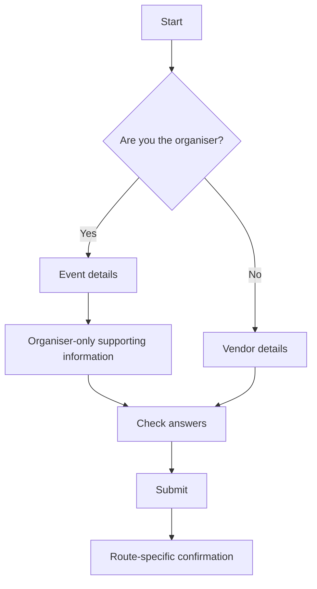

# Journey logic examples

These examples teach method, not service rules.

They are sanitised and illustrative. Do not reuse their eligibility, evidence or operational details as facts for another service.

## Example 1: simple linear journey

### Situation

A user requests a copy of an existing public record. There are no different eligibility routes and every user completes the same steps.

### Suitable representation

`Service page → Request form → Check answers → Submit → Confirmation`

### What the skill should do

Use a short sequence. Do not create a decision table or Mermaid diagram merely because mapping is available.

## Example 2: current-state journey map

### Situation

An employee believes holiday pay may be missing. The supplied evidence describes the current route but does not prove that the route is ideal.

### Observed flow

`Notice possible shortfall → Check records → Ask employer → Receive answer or no resolution → Contact the responsible office → Supply documents → Wait for review → Receive an outcome or further request`

### What the skill should notice

- several handoffs affect what the user needs to know
- the route may require preparation content before contact
- waiting, further evidence and no-response states need clear next steps
- this is an observed flow, not automatically the required future design

### Wrong conclusion to avoid

Do not state that every employee must follow these steps unless an authoritative source confirms that requirement.

## Example 3: conditional event-permit form

### Situation

A temporary event form distinguishes the organiser from individual vendors. The example does not establish real permit rules.

### Decision table

| Condition or question | Answer | What appears or changes | Outcome or next step | Evidence status and owner |
|---|---|---|---|---|
| Are you the event organiser? | Yes | Event details and organiser-only supporting information | Continue as organiser | Illustrative; service owner must confirm |
| Are you the event organiser? | No | Vendor details | Continue as vendor | Illustrative; service owner must confirm |
| Do you already hold the relevant licence? | Yes | Licence details | Continue to review | Illustrative; licensing owner must confirm |
| Do you already hold the relevant licence? | No | Guidance or inspection route | Continue through an alternative route, if confirmed | Illustrative; licensing owner must confirm |

### What the skill should check

- organiser-only questions do not appear to vendors
- licence evidence is requested only where supported
- the licence question appears before effortful uploads it may change
- each route reaches a clear outcome
- check-your-answers and confirmation reflect the route taken

### Wrong conclusion to avoid

Do not infer that the licence rules are legally required from the diagram alone.

## Example 4: improve late branching

### Observed flow

`Start → Personal details → Event details → Upload site plan → Are you the organiser? → Organiser or vendor route`

### Problem

Vendors complete event details and upload an organiser-only document before the route is known.

### Proposed flow

**Status:** Illustrative proposal requiring confirmation

`Start → Are you the organiser? → Organiser route: event details and site plan → Vendor route: vendor details → Check answers → Submit → Route-specific confirmation`

The text sequence remains necessary because Mermaid may not render in every Claude surface.

### What changes and why

- move the role question earlier to prevent irrelevant work
- keep organiser-only evidence inside the organiser route
- use route-specific review and confirmation content

### Dependencies to check

- start-page preparation content
- required uploads
- validation and errors
- check-your-answers
- confirmation screen and email

## Example 5: false simplification and unnecessary branching

### False simplification

Two routes look similar but require different evidence and lead to different outcomes. Do not combine them solely to reduce screen count.

### Unnecessary branching

Users are separated by a characteristic that does not change questions, requirements, processing or outcomes. Recommend one route unless a confirmed need justifies the distinction.

### Governing test

A branch should remain only when it prevents irrelevant work, reflects a genuine difference in requirements or produces a different outcome or next step.
