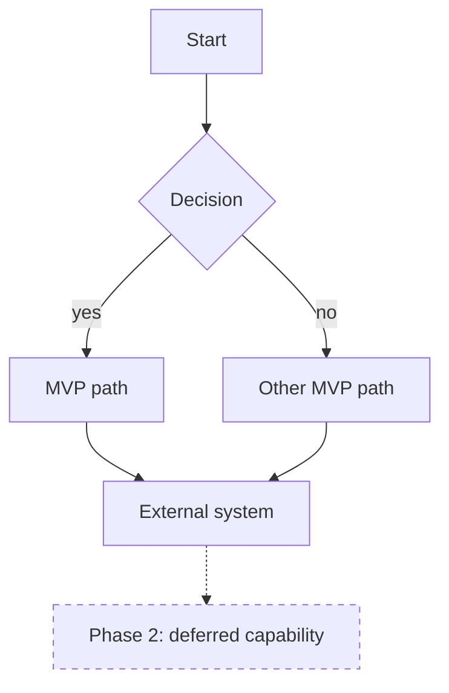

# [Service or project name] — product shape

**Source:** [URL of the brief]
**Shaped:** [date]
**Work category:** [content change | new form | new service (interactive content) | a variation/update of one of those]

## Sources read

- [URL] — [what it gave us]
- Not read: [URL] — [why it wasn't load-bearing]

## What already exists

Only when a prototype or live service was evaluated. Delete this section otherwise.

- **Works end to end:** [the steps and behaviour already implemented]
- **Implied but not built:** [what the prototype gestures at but doesn't do]
- **Prototype disagrees with the brief:** [each disagreement, and which source says what]
- **Genuinely left to build:** [the MVP candidate]

## Target customers

| Customer | What they are trying to get done |
|---|---|
| [Who they are] | [Their goal, in their words] |

## Problem to solve

### [Customer 1]
[Their problem, stated as their problem. What it costs them today.]

### [Customer 2]
[As above. One entry per customer.]

## Hypothesis

### [Customer 1] — [short name for the hypothesis]
**We believe** [change] **will cause** [outcome] **because** [reason].
**This is wrong if** [the observable result that would falsify it].

## Work category

[One category, and a one-line reason for it.]

## Scope

### MVP must-haves
- [Only what is needed to run the falsifying test.]

### Deferred
- [Everything else, with the phase it moves to.]

## Logic flow

Solid lines are the MVP. Dashed lines are deferred, labelled with their phase.

## Success metric

| Metric | Baseline | Target | How it is measured |
|---|---|---|---|
| [What we count] | [Today's number, or unknown] | [The number that means it worked] | [Where the number comes from] |

## Phased features

### Phase 1 — [name] · Now (this week)
**Proves:** [which hypothesis, and how]
**Stop if:** [the result that means we do not continue]

- [Feature]

### Phase 2 — [name] · Next week
**Proves:** [...]
**Stop if:** [...]
**Blocked on:** [external input, if any]

- [Feature]

### Phase 3 — [name] · Later
**Proves:** [...]
**Stop if:** [...]

- [Feature]

## Assumptions and confirmations needed

| Assumption | Confirmed by | Blocks |
|---|---|---|
| [What we assumed] | [Person or role] | [The phase it holds up, or nothing] |

---

Remove any row or section that does not apply. Do not leave a placeholder in place of an answer — if
something is unknown, say it is unknown and record who can settle it.
